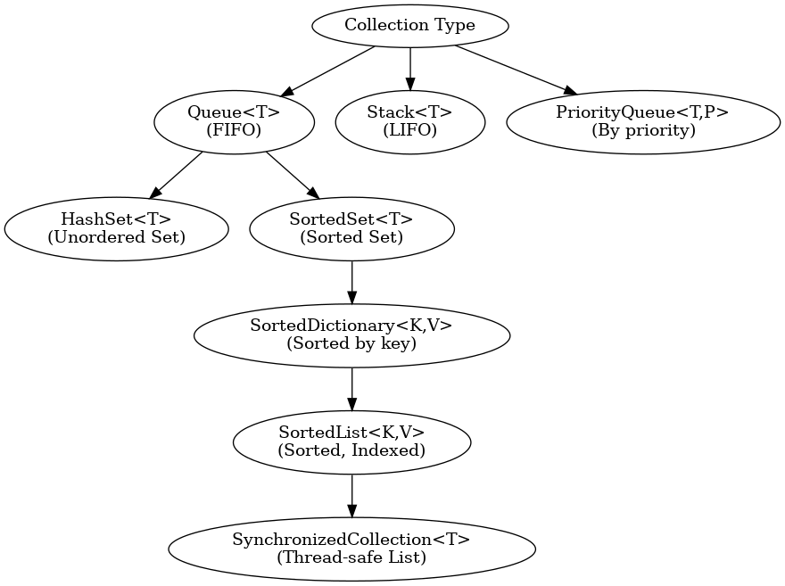
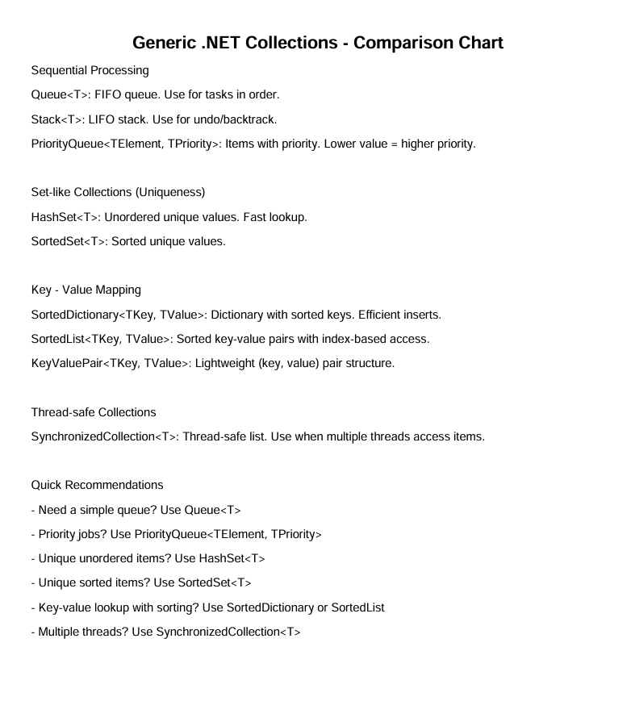

# .NET Collections in PowerSHell

### A break down in a **visual-style comparison chart**, followed by a **deeper explanation grouped by usage pattern** help provide both a mental model and practical decision points regarding .NET Collections.

 - [Summary Table](#refSummaryTable)
 - [Visual Diagram](#refVisualDiagram)
 - [Sequential Processing](#refSequentialProcessing)
 - [No Duplicate - Uniqueness](#refNoDuplicates)
 - [Key Value Pairing](#refKeyValue)
 - [Thread Safe](#refThreadSafe)
 - [Quick Guide](#refQuickGuide)
 - [Flowchart diagram image](#refFlowChart)
 - [Cheat sheet](#refCheatSheet)
 - [Printable PDF Cheat sheet](dotnet_collections_cheatsheet_ascii.pdf)


### Below is a clear explanation of each of `.NET generic collections` with simple PowerShell examples.

 - [System.Collections.Generic.Queue[string]](#refQueue)
 - [System.Collections.Generic.PriorityQueue[int,string]](#refPriorityQueue)
 - [System.Collections.Generic.HashSet[string]](#refHashSet)
 - [System.Collections.Generic.SortedDictionary[int,string]](#refSortedDictionary)
 - [System.Collections.Generic.SortedList[int,string]](#refSortedList)
 - [System.Collections.Generic.SortedSet[string]](#refSortedSet)
 - [System.Collections.Generic.Stack[string]](#refStack)
 - [System.Collections.Generic.SynchronizedCollection[string]](#refSynchronizedCollection)
 - [System.Collections.Generic.KeyValuePair[int,string]](#refKeyValuePair)
 - [Containers: Tuple, KeyValuePair or Dictionary](#refTupleKeyValuePairDict) 
 - [Tuple Real Examples](#refTupleRealExamples) 
 - [TupleComparisonTable](#refTupleComparisonTable) 
 - [Tuple Named Access](#refTupleNamedAccess) 

---


### 🔍 Summary Table
<a id="refSummaryTable"></a>
| Collection Type                       | Ordering        | Uniqueness | Thread-safe | Indexed | Use Case                        |
|--------------------------------------|-----------------|------------|-------------|---------|---------------------------------|
| `Queue<T>`<sup>[1](#refQueue)</sup>  | FIFO            | ❌         | ❌          | ❌      | Tasks, print queue              |
| `PriorityQueue<TElement, TPriority>`<sup>[2](#refPriorityQueue)</sup> | By priority     | ❌         | ❌          | ❌      | Scheduling by priority          |
| `HashSet<T>`<sup>[3](#refHashSet)</sup>                         | Unordered       | ✅         | ❌          | ❌      | Unique values, fast lookup      |
| `SortedDictionary<TKey,TValue>`<sup>[4](#refSortedDictionary)</sup>      | Sorted by key   | ✅ (keys)  | ❌          | ❌      | Map with sorted keys            |
| `SortedList<TKey,TValue>`<sup>[5](#refSortedList)</sup>            | Sorted by key   | ✅ (keys)  | ❌          | ✅      | Sorted, indexable dictionary    |
| `SortedSet<T>`<sup>[6](#refSortedSet)</sup>                       | Sorted          | ✅         | ❌          | ❌      | Sorted unique values            |
| `Stack<T>`<sup>[7](#refStack)</sup>                           | LIFO            | ❌         | ❌          | ❌      | Undo, reverse-order processing  |
| `SynchronizedCollection<T>`<sup>[8](#refSynchronizedCollection)</sup>          | As inserted     | ❌         | ✅          | ✅      | Multi-threaded environments     |


---

## 🔍 Visual Diagram of .NET Generic Collections
<a id="refVisualDiagram"></a>
```
                ┌────────────────────┐
                │   Collection Type  │
                └────────┬───────────┘
                         │
       ┌─────────────────┼────────────────────┐
       ▼                 ▼                    ▼
 [Queue<T>]        [Stack<T>]           [PriorityQueue<T,P>]
 (FIFO order)      (LIFO order)         (Ordered by priority)

       │                 │
   Sequential        Sequential
    Access            Access

       ▼
 ┌────────────────────────────────────────────┐
 │         Keyed or Unkeyed Structures        │
 └────────────────────────────────────────────┘

 ┌─────────────┬─────────────────────┬────────────────────┐
 ▼             ▼                     ▼                    ▼
[HashSet<T>] [SortedSet<T>]    [SortedDictionary<K,V>]  [SortedList<K,V>]
(Unordered)   (Sorted)          (Sorted by key)         (Sorted + indexed)

                   ▼
         [SynchronizedCollection<T>]
            (Thread-safe, list-like)
```

---

## 📘 Deeper Comparison by Use Case

<a id="refSequentialProcessing"></a>
### 🌀 **Sequential Processing**

| Collection | Description | Order | Notes |
|-----------|-------------|-------|-------|
| **Queue<T>** | First-In-First-Out | Yes | `Enqueue()` → `Dequeue()`, e.g. task queue |
| **Stack<T>** | Last-In-First-Out | Yes | `Push()` → `Pop()`, e.g. undo history |
| **PriorityQueue<TElement, TPriority>** | Ordered by priority | Yes (by `TPriority`) | Lower priority values come out first |

---

### 🧩 **Set-like Behavior (Uniqueness)**
<a id="refNoDuplicates"></a>
| Collection | Sorted? | Thread-safe? | Notes |
|------------|---------|--------------|-------|
| **HashSet<T>** | ❌ | ❌ | Unordered set, fastest for existence checks |
| **SortedSet<T>** | ✅ | ❌ | Keeps elements in sorted order, e.g. "abc..." |

---

### 🔑 **Key → Value Mapping**
<a id="refKeyValue"></a>
| Collection | Sorted? | Indexed Access? | Notes |
|------------|---------|------------------|-------|
| **SortedDictionary<TKey, TValue>** | ✅ | ❌ | Better for frequent inserts/removals |
| **SortedList<TKey, TValue>** | ✅ | ✅ | Better for small datasets & index access |
| **PriorityQueue<TElement, TPriority>** | Partially (by priority) | ❌ | Not a full dictionary, but uses key concept |
| **KeyValuePair<TKey, TValue>** | — | — | Lightweight struct for representing a pair |

---

### 🔐 **Thread-safe Use**
<a id="refThreadSafe"></a>
| Collection | Description |
|------------|-------------|
| **SynchronizedCollection<T>** | Lock-wrapped version of a list. Useful in multi-threaded scripts or background jobs |

---

## ✅ When to Use What (Quick Guide)
<a id="refQuickGuide"></a>
| Situation | Recommended Collection |
|-----------|------------------------|
| Task queue, producer-consumer | `Queue<T>`<sup>[1](#refQueue)</sup> |
| Undo/redo, backtracking | `Stack<T>`<sup>[2](#refStack)</sup> |
| Priority-based jobs | `PriorityQueue<TElement, TPriority>`<sup>[3](#refPriorityQueue)</sup> |
| Unique items, fast lookup | `HashSet<T>`<sup>[3](#refHashSet)</sup> |
| Unique sorted items | `SortedSet<T>`<sup>[4](#refSortedSet)</sup> |
| Mapping keys to values | `SortedDictionary<K,V>`<sup>[5](#refSortedDictionary)</sup> or `SortedList<K,V>`<sup>[6](#refSortedList)</sup> |
| Thread-safe collection of items | `SynchronizedCollection<T>`<sup>[7](#refSynchronizedCollection)</sup> |
| Returning 2 related values | `KeyValuePair<K,V>`<sup>[8](#refKeyValuePair)</sup> |

---

<a id="refQueue"></a>
### 🔹 `[System.Collections.Generic.Queue[string]]`  
**Type**: FIFO (First-In-First-Out) collection.

**Use when**: You want to process items in the order they were added (e.g., print jobs, tasks).

**Example**:
```powershell
$q = [System.Collections.Generic.Queue[string]]::new()
$q.Enqueue("task1")
$q.Enqueue("task2")
$q.Dequeue()  # Output: task1
```

---
<a id="refPriorityQueue"></a>
### 🔹 `[System.Collections.Generic.PriorityQueue[int, string]]`  
**Type**: Queue where items are dequeued based on **priority**.

**Use when**: You want to process items by priority rather than insertion order.

**Example**:
```powershell
$pq = [System.Collections.Generic.PriorityQueue[int, string]]::new()
$pq.Enqueue(42, "low")     # Value: 42, Priority: "low"
$pq.Enqueue(7, "high")     # Value: 7, Priority: "high"
$pq.Dequeue()              # Output: 7 (since "high" < "low" lexicographically)
```

📝 In this case, lower string values = higher priority. You can define custom comparers too.

---
<a id="refHashSet"></a>
### 🔹 `[System.Collections.Generic.HashSet[string]]`  
**Type**: Unordered collection of **unique** values.

**Use when**: You need fast lookups and don't want duplicates.

**Example**:
```powershell
$set = [System.Collections.Generic.HashSet[string]]::new()
$set.Add("apple")
$set.Add("banana")
$set.Add("apple")  # Won't be added again
$set.Count         # Output: 2
```

---
<a id="refSortedDictionary"></a>
### 🔹 `[System.Collections.Generic.SortedDictionary[int, string]]`  
**Type**: Dictionary that keeps keys **sorted**.

**Use when**: You want fast lookups **and** need keys in sorted order.

**Example**:
```powershell
$sd = [System.Collections.Generic.SortedDictionary[int, string]]::new()
$sd.Add(3, "c")
$sd.Add(1, "a")
$sd.Add(2, "b")

foreach ($kv in $sd) {
    "$($kv.Key) => $($kv.Value)"
}
# Output in order: 1 => a, 2 => b, 3 => c
```

---
<a id="refSortedList"></a>
### 🔹 `[System.Collections.Generic.SortedList[int, string]]`  
**Type**: Like `SortedDictionary`, but **backed by an array** and uses **less memory**.

**Use when**: You have relatively **few items** and want fast indexed access and sorted keys.

**Example**:
```powershell
$sl = [System.Collections.Generic.SortedList[int, string]]::new()
$sl.Add(10, "ten")
$sl.Add(5, "five")
$sl.Values[0]  # Output: "five"
```

🆚 Compared to `SortedDictionary`, `SortedList` is better for smaller datasets or when index-based access is needed.

---
<a id="refSortedSet"></a>
### 🔹 `[System.Collections.Generic.SortedSet[string]]`  
**Type**: Set of **unique values** that are **automatically sorted**.

**Use when**: You need a sorted, duplicate-free list of items.

**Example**:
```powershell
$ss = [System.Collections.Generic.SortedSet[string]]::new()
$ss.Add("banana")
$ss.Add("apple")
$ss.Add("banana")  # Ignored
$ss                # Output: apple, banana (sorted)
```

---
<a id="refStack"></a>
### 🔹 `[System.Collections.Generic.Stack[string]]`  
**Type**: LIFO (Last-In-First-Out) stack.

**Use when**: You want to access items in reverse order of how they were added (e.g., undo history).

**Example**:
```powershell
$s = [System.Collections.Generic.Stack[string]]::new()
$s.Push("step1")
$s.Push("step2")
$s.Pop()  # Output: step2
```

---
<a id="refSynchronizedCollection"></a>
### 🔹 `[System.Collections.Generic.SynchronizedCollection[string]]`  
**Type**: Thread-safe collection.

**Use when**: You're working with **multiple threads** and need to safely add/remove items.

**Example**:
```powershell
$sync = [System.Collections.Generic.SynchronizedCollection[string]]::new()
$sync.Add("log1")
$sync.Add("log2")
$sync[0]  # Output: log1
```

🔐 Ensures that only one thread modifies the collection at a time.

---


### 🔹 `[System.Collections.Generic.KeyValuePair[int, string]]`
<a id="refKeyValuePair"></a>

`[System.Collections.Generic.KeyValuePair[int, string]]` (or more generally, `KeyValuePair<TKey, TValue>`) is used when you want to **store a pair of related values together** — a **key** and a **value** — in a lightweight structure.

When you enumerate a dictionary (`[Dictionary[int, string]]`), each item is returned as a `KeyValuePair<TKey, TValue>` so you **don’t usually create `KeyValuePair` manually**, but you deal with them when enumerating dictionaries.


```powershell
$dict = [System.Collections.Generic.Dictionary[int, string]]::new()
$dict.Add(1, "One")
$dict.Add(2, "Two")

foreach ($pair in $dict) {
    "$($pair.Key) => $($pair.Value)"
}
```

Sometimes you want a method to return two related values, and `KeyValuePair<TKey, TValue>` is a lightweight and clear way to do that:

```powershell
function Get-IdAndName {
    return [System.Collections.Generic.KeyValuePair[int, string]]::new(42, "Guillaume")
}

$result = Get-IdAndName
"ID: $($result.Key), Name: $($result.Value)"
```

If you need a **list of key/value pairs**, but don’t need fast lookup or don’t want to use a dictionary:


```powershell
$pairs = [System.Collections.Generic.List[System.Collections.Generic.KeyValuePair[int,string]]]::new()
$pairs.Add([System.Collections.Generic.KeyValuePair[int,string]]::new(1, "apple"))
$pairs.Add([System.Collections.Generic.KeyValuePair[int,string]]::new(2, "banana"))

foreach ($pair in $pairs) {
    "$($pair.Key): $($pair.Value)"
}
```


When *Not* to Use It: 

- If you're just pairing two values without a "key → value" relationship, a `[Tuple[int, string]]` might be more semantically correct.
- If you need fast key-based lookup, use `[Dictionary[int, string]]` directly instead of a list of pairs.

Summary:

| Use Case                        | Recommended |
|--------------------------------|-------------|
| Iterating over a dictionary    | ✅ Yes      |
| Storing a simple (key, value) pair | ✅ Yes  |
| Returning two related values from a function | ✅ Yes |
| Fast key lookup                | ❌ No — use Dictionary instead |
| Pairing values with no clear "key" | ❓ Maybe Tuple instead |


<a id="refFlowChart"></a>

### 🔹 Flowchart diagram image showing the relationship and usage of generic collections



---


<a id="refCheatSheet"></a>

### 🔹Cheat sheet with detailed usage comparison

[Printable PDF Cheat sheet](dotnet_collections_cheatsheet_ascii.pdf)



---


<a id="refTupleKeyValuePairDict"></a>


# Choosing between `Tuple`, `KeyValuePair`, and `Dictionary` 

This depends on **what you're modeling**, **how you want to access it**, and **what guarantees (like uniqueness) you need**.

Below is a step-by-step guide with with real-world-style **decision criteria**, **comparison table**, and **PowerShell examples**.

---

## 🧠 Decision Criteria

| Question | Go with |
|---------|---------|
| Do you need to store a **key-value pair** with uniqueness on keys and fast lookup? | `Dictionary<TKey, TValue>` |
| Do you want to **return two values** from a method/function? | `Tuple<T1, T2>` |
| Are you **iterating through** a dictionary or representing a lightweight relationship? | `KeyValuePair<TKey, TValue>` |
| Do you want **named access** to the values? | Use **Tuple (named)** or create a custom object |
| Do you want to **store multiple pairs** in a collection? | `List<KeyValuePair<TKey, TValue>>` or `Dictionary` |
| Is key order important? | Use `SortedDictionary<TKey, TValue>` |

---

## 🆚 Comparison Table
<a id="refTupleComparisonTable"></a>
| Feature                 | `Tuple<T1, T2>`                  | `KeyValuePair<TKey, TValue>`         | `Dictionary<TKey, TValue>`        |
|------------------------|----------------------------------|--------------------------------------|----------------------------------|
| Key-based lookup       | ❌                                | ❌                                    | ✅                              |
| Unique keys enforced   | ❌                                | ❌                                    | ✅                              |
| Access by name         | ⚠️ (`Item1`, `Item2`)             | ✅ (`.Key`, `.Value`)                | ✅ (`$dict[$key]`)              |
| Modifiable             | ⚠️ Immutable                     | ✅ (mutable fields)                   | ✅                              |
| Stores many pairs      | ⚠️ Needs list/array               | ✅ Often used in lists                | ✅ Built-in                     |
| Indexed access         | ✅ (via array)                    | ⚠️ (via list)                         | ❌ (keys are hashed)            |
| Ordering guaranteed?   | ❌                                | ⚠️ (depends on container)             | ❌ (unless `SortedDictionary`)  |

---

## 🔁 Real Examples
<a id="refTupleRealExamples"></a>
### ✅ **Tuple**: Return two values
```powershell
function Get-NameAndAge {
    return [Tuple[string, int]]::new("Alice", 30)
}

$t = Get-NameAndAge
"Name: $($t.Item1), Age: $($t.Item2)"
```
📌 Use for small, temporary structures. Not ideal for readability if `Item1`, `Item2`, etc. get confusing.

---

### ✅ **KeyValuePair**: Represent a pair in a list
```powershell
$pairs = [System.Collections.Generic.List[System.Collections.Generic.KeyValuePair[string,int]]]::new()
$pairs.Add([System.Collections.Generic.KeyValuePair[string,int]]::new("Banana", 2))
$pairs.Add([System.Collections.Generic.KeyValuePair[string,int]]::new("Apple", 5))

foreach ($pair in $pairs) {
    "$($pair.Key): $($pair.Value)"
}
```
📌 Ideal for **enumerating** or **building** key-value-like structures without enforcing uniqueness.

---

### ✅ **Dictionary**: Enforce unique keys with fast lookup
```powershell
$dict = [System.Collections.Generic.Dictionary[string, int]]::new()
$dict.Add("Banana", 2)
$dict.Add("Apple", 5)

$dict["Apple"]  # Returns 5
```
📌 Best for **mapping** scenarios, like settings, config, indexed data. Fast and powerful.

---

## 🎯 Summary Cheat Sheet

| Use Case                          | Best Choice             |
|----------------------------------|-------------------------|
| Return 2+ values from function   | `Tuple<T1, T2>`         |
| Store pair in a list             | `KeyValuePair<K, V>`    |
| One-time mapping with lookup     | `Dictionary<K, V>`      |
| Unique key-value set             | `Dictionary<K, V>`      |
| Represent small record           | `Tuple<T1, T2>` or custom class |

---

## Tuple Named Access
<a id="refTupleNamedAccess"></a>
Want named access on a tuple?

```powershell
# With ValueTuple and named elements (PowerShell 7+)
$t = [ValueTuple[string, int]]::new("Bob", 25)
$name = $t.Item1
$age = $t.Item2
```

---
